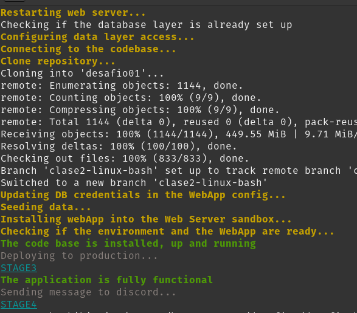

# DevOps Bootcamp #

This is the repository of the 4th edition of DevOps Bootcamp by Rossana Suarez

## Content ##
- Challenges
- Personal Notes in Obsidian format
- examples and other exercises

## 1. Challenge 01 ##

### 1.1 Requirements ###
[requirements](https://github.com/hftamayo/devopsrossrox/blob/main/bootcamp2023/desafios/desafio01/enunciado.md)

### 1.2 Bugs ###
* Not seeding if the data layer is already set up -> solved by [William Yataco](https://github.com/hftamayo/devopsrossrox/pull/1)
* Checking if the data layer exists -> solved by [William Yataco](https://github.com/hftamayo/devopsrossrox/pull/1)
* Possible security bugs since the script requires admin privileges
* Using colors for messages to the user -> solved by [William Yataco](https://github.com/hftamayo/devopsrossrox/pull/1)

### 1.3 Script Details ###
[source_code](https://github.com/hftamayo/devopsrossrox/blob/main/bootcamp2023/desafios/desafio01/entregable/travelapp.sh)

### 1.4 Proof of Concept ###
[Proof of Concept](https://youtu.be/bg_oXN9kMOA)

### 1.5 Changes after PR0001 by William Yataco ###

## 2 Challenge 02 ##
Due to the complexity of challenge02, theres is a dedicated branch for it, for further details please use the next link:
[challenge 02 readme](https://github.com/hftamayo/devopsrossrox/blob/desafio02/README.md)

### References ###
* [MongoDB-Express Admin Tool Official Repo](https://github.com/mongo-express/mongo-express)
