## Diagram of the Solution ##

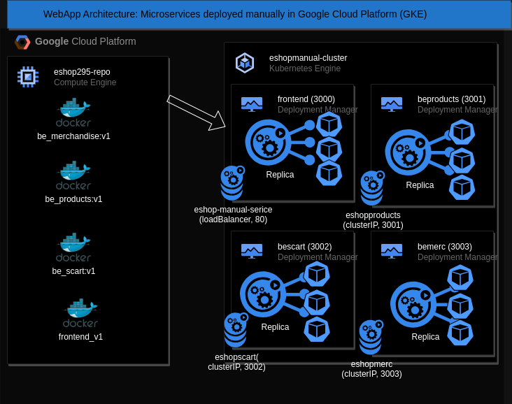

## Steps to reproduce the deployment process ##

1. Setting up the PROJECT_ID variable for use it in the Google Cloud CLI and creating the repository:

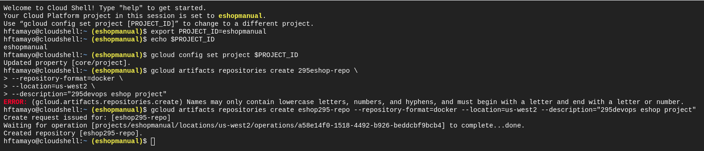

2. Verifing if the Repository was created

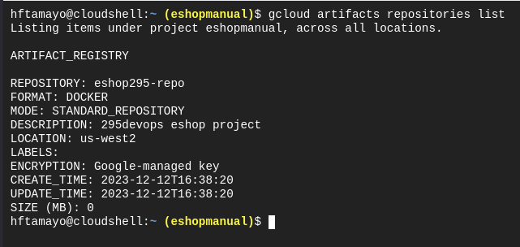

3. Cloning the github's repository into my GCP project's repository (backend microservices)

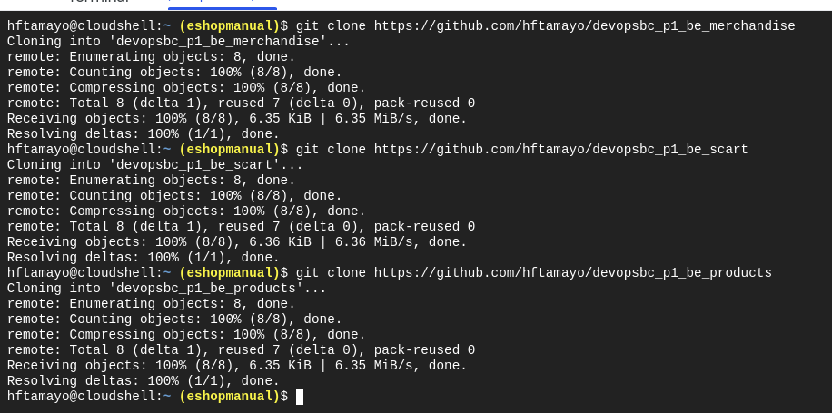

4. Cloning the github's repository into the GCP project's repo (frontend microservice)

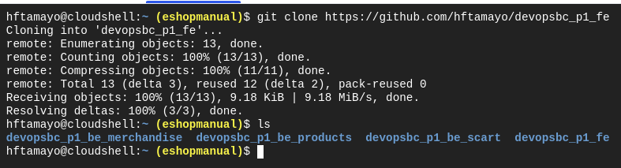

5. Building each Docker image for each cloned repository

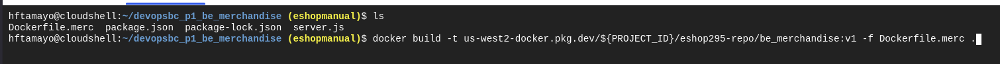

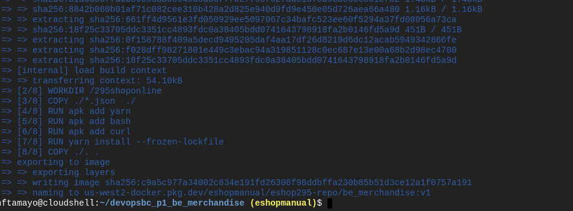

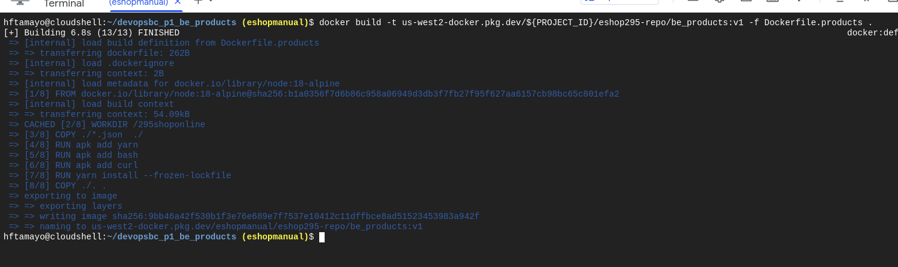

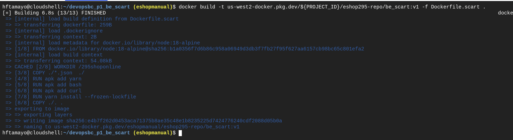

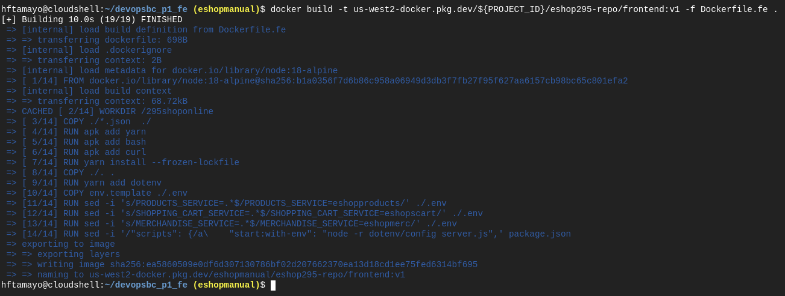

6. Checking if the images were created:

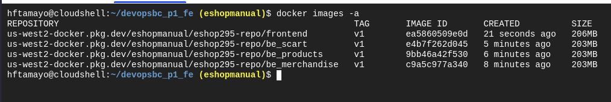

7. Adding an IAM policy for the current account:

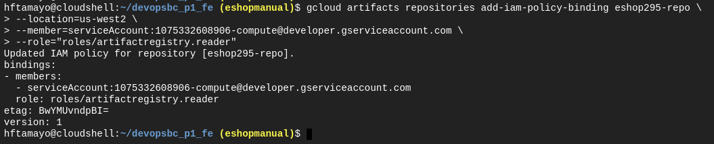

8. Pushing the docker images to the artifact registry:

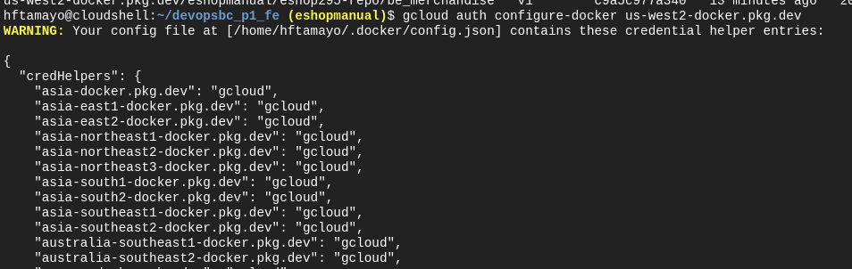

...

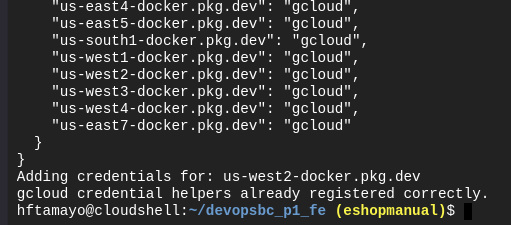

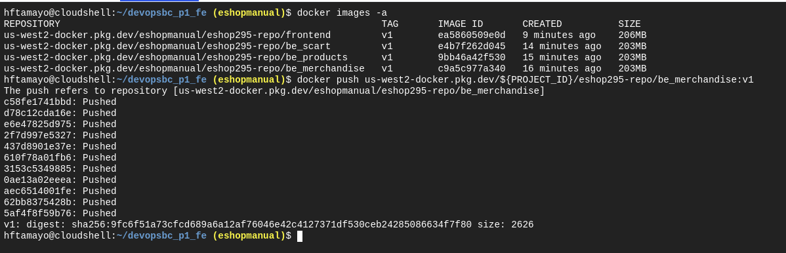

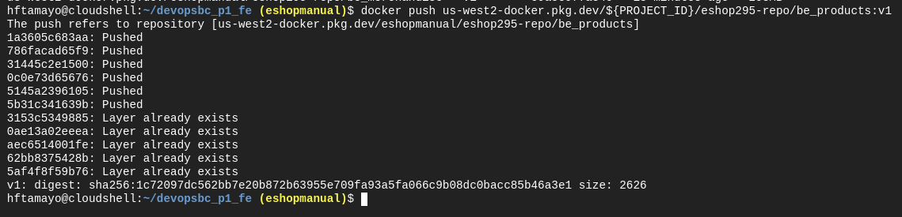

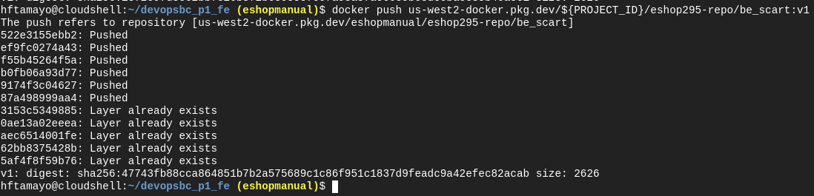

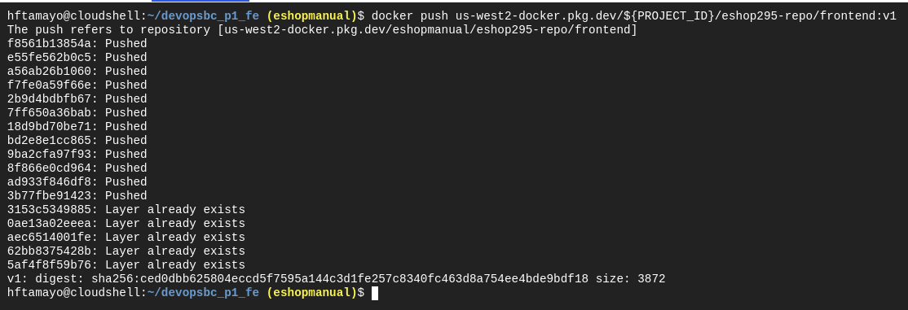

9. Setting up the Compute Engine region:

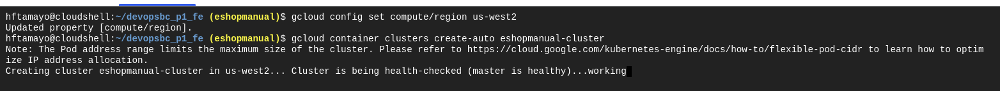

10. Creating a K8s cluster for the project:

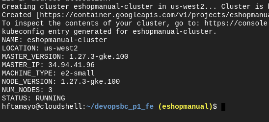

11. Ensuring the connection with the Google Kubernetes Engine Cluster and creating a Kubernete deployment for each Docker Image:

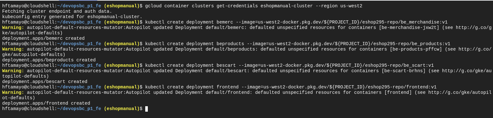

12. Setting up the baseline number of deployment replicas to 3:

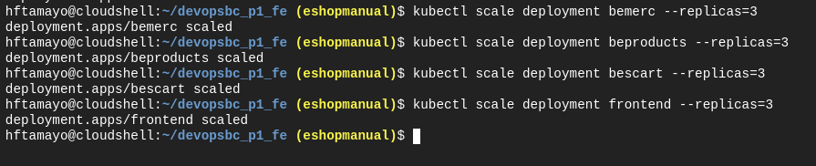

13. Setting up the autoscaling resources to each deployment:

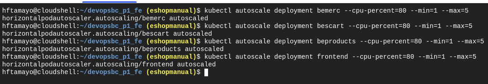

14. Checking the available pods related to each deployment:

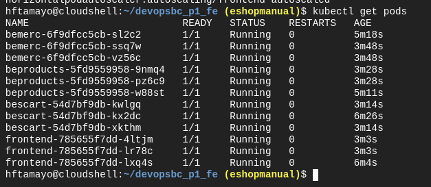

15. Exposing the FrontEnd deployment into a Kubernete service:

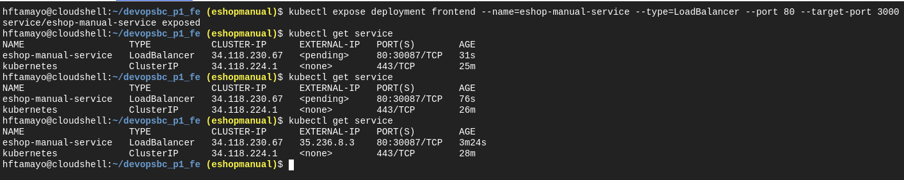

16. the first external IP Address is 35.236.8.3:

however the data is not displayed:

17. Checking the services:

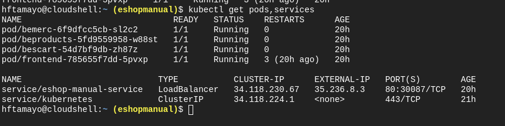

18. The idea is to have one k8s service per each microservice:

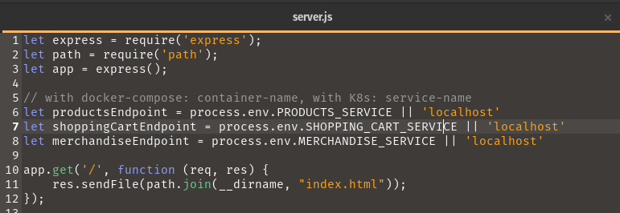

In my Dockerfile I set:

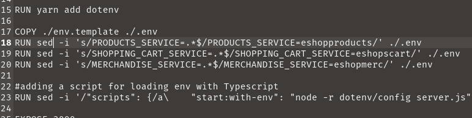

19. Checking the current k8s deployments: 

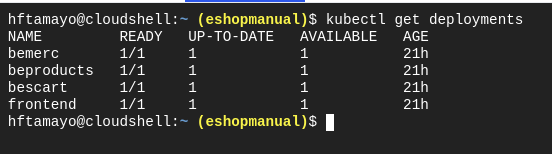

20. Creating one service per each deployment:

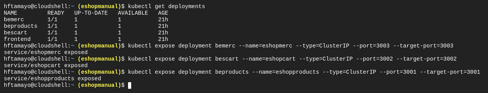

21. Checking again the available services:

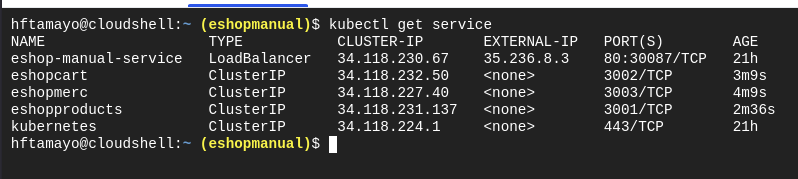

22. Verifying if the data is available:

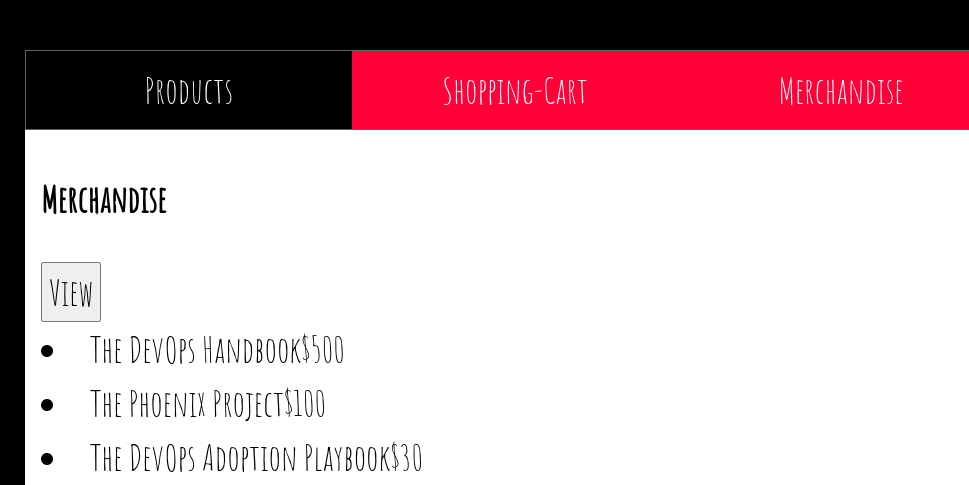
